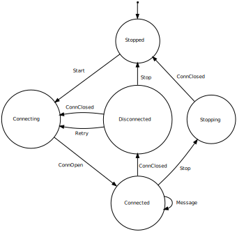
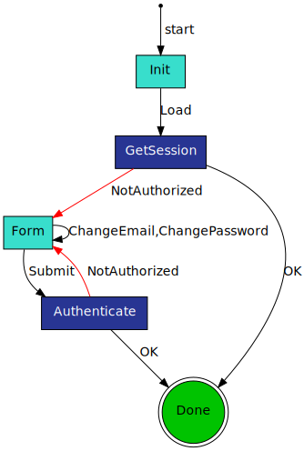

# machine

Minimal, zero-dependency state machine implementation in javascript.

## Example 1: Websocket

Consider implementing a wrapper around a browser websocket connection. Your API might support starting and stopping the websocket connection, handling reconnects when there is an unexpected disconnect, and handling sending and recieving messages when the connection is open.

We can visualise how should work with the following state machine:



The machine is initially in the `Stopped` state. We specify this when we create our state machine:
```js
// WebsocketMachine.js
import StateMachine from './StateMachine'

const WebsocketMachine = StateMachine('Stopped')
```

This demonstrates how the StateMachine function is used to bootstrap a new state machine. The function takes as first argument an enum to set the initial state, and an optional second argument which is a callback for when there is an error. 

From the `Stopped` state there is only the `Start` transition event, which we can specify:
```js
// WebsocketMachine.js
import StateMachine from './StateMachine'

const WebsocketMachine = StateMachine('Stopped')

WebsocketMachine.transition('Stopped', 'Start', (m, data) => {
    m.setState('Connecting')
    // todo: bootstrap new ws connection
})
```

This example demonstrates the `transition` method, which takes three arguments:
1. A *State* enum
2. An *Event* enum
3. A callback function which is called when that event is fired from that state. 

The callback function itself takes two arguments:
1. The state machine instance itself
2. (Optional) any data passed along with the event.

The state machine instance supports two methods:
1. `m.setState(state)` which is used to change the state of the state machine
2. `m.dispatch(event, data)` which is used to dispatch an event with optionally any data

To illustrate how dispatching events works, we can next implement the bootstrapping of the websocket connection:

```js
// WebsocketMachine.js
import StateMachine from './StateMachine'

const WebsocketMachine = StateMachine('Stopped')

WebsocketMachine.transition('Stopped', 'Start', (m, data) => {
    m.setState('Connecting')
    bootstrapWSConnection(m)
})

function bootstrapWSConnection(m) {
    // create a new websocket connection
    const conn = new WebSocket('wss://app.com')

    // proxy each websocket event to our own dispatcher
    conn.onopen = () => m.dispatch('ConnOpen')
    conn.onclose = () => m.dispatch('ConnClosed')
    conn.onmessage = msg => m.dispatch('Msg', msg)

    ws.model.conn = conn
}
```

Here you can see we added a helper function `bootstrapWSConnection` which creates a new websocket connection and proxies all of its events to the machine's own dispatcher. Notice that we only pass data along with the `Msg` event. Finally we save the connection onto the `model` property of the machine, which is a special property for the state machine instance to save its own model data.

We can implement the rest of our state machine in the same way to arrive at the final result:

```js
import StateMachine from './StateMachine'

const WebsocketMachine = StateMachine('Stopped')

// Stopped
WebsocketMachine.transition('Stopped', 'Start', m => {
    m.setState('Connecting')
    bootstrapWSConnection(m)
})

// Connecting
WebsocketMachine.transition('Connecting', 'ConnOpen', m => {
    m.setState('Connected')
})
WebsocketMachine.transition('Connecting', 'ConnClosed', m => {
    m.setState('Disconnected')
    setTimeout(() => m.dispatch('Retry'), 1000)
})

// Connected
WebsocketMachine.transition('Connected', 'Stop', (m, data) => {
    m.setState('Stopping')
    m.model.conn.close()
    m.model.conn = null
})
WebsocketMachine.transition('Connected', 'ConnClosed', m => {
    m.setState('Disconnected')
    setTimeout(() => m.dispatch('Retry'), 1000)
})
WebsocketMachine.transition('Connected', 'Message', (m, data) => {
    m.model.onMessage(data)
})

// Disconnected
WebsocketMachine.transition('Disconnected', 'Retry', m => {
    m.setState('Connecting')
    bootstrapWSConnection(m)
})
WebsocketMachine.transition('Disconnected', 'Stop', m => {
    m.setState('Stopped')
})

// Stopping
WebsocketMachine.transition('Stopping', 'ConnClosed', m => {
    m.setState('Stopped')
})

export default WebsocketMachine
```

Now that we are done scaffolding our state machine, we can use it:

```js
// app.js
import WebsocketMachine from './WebsocketMachine'

const model = {
    onMessage(msg) {
        console.log(msg)
    }
}

const ws = WebsocketMachine.start(model)
```

This illustrates the `start` method, which returns a new instance of the state machine. It takes as argument a model which can be mutated and accessed internally by the state machine - in this case it provides a callback to be used when there is a websocket message arriving.

## Example 2: Login Form

### The state machine


### The screens


### Start from the tests

```js
// LoginMachineTest.js
import { expect } from 'chai'
import Machine from './LoginMachine'

describe('LoginMachine', () => {
    it('starts in INIT state', () => {
        // start a new instance of the machine
        const m = Machine.start()
        
        // assert the initial state is 'init'
         expect(m.state).equal('Init')
    })
})
```

We can make it pass by:

```js
// LoginMachine.js
import StateMachine from 'machine'

// Create a new state machine with 'init' as initial state
const Machine = StateMachine('Init')

export default Machine
```

Great. Looking at our state machine diagram then, we can see the valid only transition from Init state is the "Load" event.
This is fired when the app has loaded and ready to start. When this occurs, we want to send an api request to our backend endpoint '/get-session' to see if we are already logged in. We write up a test to reflect this directly:

```js
// LoginMachineTest.js
import sinon from 'sinon'

const sandbox = sinon.createSandbox()

describe('Init', () => {
    afterEach(sandbox.restore)

    it('Load', () => {
        // Given we are in the Init state
        const m = Machine.start()

        // and that our backend api is mocked
        const api = sandbox.stub(Api, 'post').returns(Promise.defer().promise)

        // When the 'Load' event is dispatched
        m.dispatch('Load')

        // Then we should be in the 'GetSession' state
        expect(m.state).equal('GetSession')

        // And an api request to '/get-session' should have been called
        sinon.assert.calledWith(api, '/get-session')
    })
})
```

If we run this test we should get the error: `Error: transition Init:Load not defined`. This points us in the right direction.

```js
// LoginMachine.js

Machine.transition('Init', 'Load', m => {
    // first set the new state on the machine
    m.setState('GetSession')

    // send the api request
    Api.post('/get-session')
        .then(() => m.dispatch('OK')) // if successful, dispatch OK
        .catch(err => m.dispatch(err)) // if error, dispatch the error
})
```

A transition definition takes a State, Event, and Callback as arguments. The Callback takes as argument an instance of the machine itself, and any data passed along with the Event.

Next we can look at the 'GetSession' state, it needs to handle both the 'OK' and 'NotAuthorized' events
```js
// LoginMachineTest.js

describe('GetSession', () => {

    it('OK', () => {
        const m = Machine.start()
        m.setState('GetSession')

        m.dispatch('OK')

        expect(m.state).equal('Done')
    })

    it('NotAuthorized', () => {
        const m = Machine.start()
        m.setState('GetSession')

        m.dispatch('NotAuthorized')

        expect(m.state).equal('Form')
    })
})
```

We should now see `Error: transition GetSession:OK not defined` and `Error: transition GetSession:NotAuthorized not defined`

```js
// LoginMachine.js
Machine.transition('GetSession', 'OK', m => {
    m.setState('Done')
})

Machine.transition('GetSession', 'NotAuthorized', m => {
    m.setState('Form')
})
```

Next, we can write our test for the 'Form' state:

```js
describe('Form', () => {
    it('ChangeEmail,ChangePassword', () => {
        // Given our initial model
        const model = {
            email: '',
            password: '',
        }
        const m = Machine.start(model)

        // And that we are in the 'Form' state
        m.setState('Form')

        // When the ChangeEmail event is dispatched with an email
        m.dispatch('ChangeEmail', 'hello@des.io')

        // Then we should remain in the Form state
        expect(m.state).equals('Form')

        // And our model should have the updated email
        expect(model.email).equals('hello@des.io')

        // When the ChangePassword event is dispatched with a password
        m.dispatch('ChangePassword', 'abc123')

        // Then we should remain in the Form state
        expect(m.state).equals('Form')

        // And our model should have the updated email
        expect(model.password).equals('abc123')
    })
})
```

Making that pass:

```js
Machine.transition('Form', 'ChangeEmail', (m, email) => {
    m.model.email = email
})

Machine.transition('Form', 'ChangePassword', (m, password) => {
    m.model.password = password
})
```

And then we can submit the form:

```js
describe('Form', () => {
    it('Submit', () => {
        // Given our initial model
        const model = {
            email: 'hell@des.io',
            password: 'abc123',
        }
        const m = Machine.start(model)
    
        // and that our backend api is mocked
        const api = sandbox.stub(Api, 'post')
        api.returns(Promise.defer().promise)
    
        // And that we are in the 'Form' state
        m.setState('Form')
    
        // When the Submit event is fired
        m.dispatch('Submit')
    
        // Then we should be in the Authenticate state
        expect(m.state).equals('Authenticate')
    
        // And an api request to '/authenticate' should have been called with the form data
        sinon.assert.calledWith(api, '/authenticate', {
            email: 'hell@des.io',
            password: 'abc123',
        })
    })
})
```

making it pass, we can (notice we use model on the machine here):

```js
Machine.transition('Form', 'Submit', m => {
    m.setState('Authenticate')

    Api.post('/authenticate', m.model)
        .then(() => m.dispatch('OK')) // if successful, dispatch OK
        .catch(err => m.dispatch(err)) // if error, dispatch the error
})
```

Finally:

```js
describe('Authenticate', () => {
    it('OK', () => {
        const m = Machine.start()
        m.setState('Authenticate')
        m.dispatch('OK')
        expect(m.state).equals('Done')
    })

    it('NotAuthorized', () => {
        const m = Machine.start()
        m.setState('Authenticate')
        m.dispatch('NotAuthorized')
        expect(m.state).equals('Form')
    })
})
```

```js
Machine.transition('Authenticate', 'OK', m => m.setState('Done'))
Machine.transition('Authenticate', 'NotAuthorized', m => m.setState('Form'))
```


# Full code:
```js
// LoginMachine.js
import StateMachine from '../src/StateMachine'
import Api from './Api'

const Machine = StateMachine('Init')

// State: Init
Machine.transition('Init', 'Load', m => {
    // first set the new state on the machine
    m.setState('GetSession')

    // send the api request
    Api.post('/get-session')
        .then(() => m.dispatch('OK')) // if successful, dispatch OK
        .catch(err => m.dispatch(err)) // if error, dispatch the error
})

// State: GetSession
Machine.transition('GetSession', 'OK', m => m.setState('Done'))
Machine.transition('GetSession', 'NotAuthorized', m => m.setState('Form'))

// State: Form
Machine.transition('Form', 'ChangeEmail', (m, email) => m.model.email = email)
Machine.transition('Form', 'ChangePassword', (m, password) => m.model.password = password)
Machine.transition('Form', 'Submit', m => {
    m.setState('Authenticate')

    Api.post('/authenticate', m.model)
        .then(() => m.dispatch('OK')) // if successful, dispatch OK
        .catch(err => m.dispatch(err)) // if error, dispatch the error
})

// State: Authenticate
Machine.transition('Authenticate', 'OK', m => m.setState('Done'))
Machine.transition('Authenticate', 'NotAuthorized', m => m.setState('Form'))

export default Machine
```


